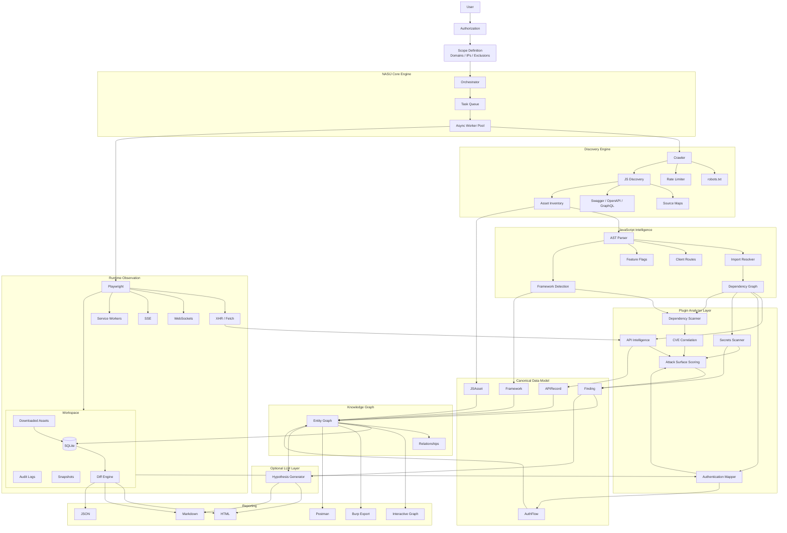

<div align="center">

```
                         ,▄▄▓⌐
                       ▐▀▄▄▀█▄
                       ╙██    █▌
              ¬,╓▄▄▄æR▀▀██▄,,▄█▀█▄
       ▄▀▀▀▀▀φ▄▄L,,,╓   ▄▄▄æφ▄  ▓▀▀╙╙██─   █    ╫███─    ██▄
     ╓▌           ─ ██▄j▌    ██▄█    █▌   j█     ▀▀╙     ████
     █   ,▄▄.       ████▌    ╙█▀▀    ╙                  █████⌐
     ▀██▌▀─        ╙╙╙└─                      ╔      ,▄██████
      █└    ,▄▓█           ,       ç   ,▓▄╓╓▄▓███▓▓█████████▀
     █     ▓▀  ╙▓,       ╓▓██▄▄▄▓█████████████████████████▀─
     ▌     █▄  ▄███████▀▀▀█▀└└╙███████▀██████████▀~╙▀▀▀▀└
     █      ╙╙╙╙└  ╙██▌        ████▌▄▓█████
     ╙▓             ███▓▄▄██▓▓█████████████Γ
       ▀▓▄µ    ,▄▄▓████████████████▌└██▀▀┘
         ▀███████████████ ▀███▀▀▀▀╙
          ┘▀██████████▀▀┘
              ┘┴┘¬
```

</div>

---

## Overview

NASIJ is an intelligent reconnaissance framework designed for **authorized Bug Bounty programs, Penetration Tests, and Application Security assessments**.

Unlike traditional reconnaissance tools that generate flat lists of URLs or endpoints, NASIJ builds an **interactive knowledge graph** describing how a web application works.

It correlates JavaScript, APIs, authentication, runtime behavior, dependencies, and framework intelligence into a unified model that helps researchers quickly understand an application's attack surface.

---

## Vision

Modern web applications are complex.

Traditional recon produces thousands of URLs, endpoints, and JavaScript files, forcing researchers to manually connect everything together.

NASIJ automates that correlation.

```
Application
      │
      ▼
JavaScript
      │
      ▼
APIs
      │
      ▼
Authentication
      │
      ▼
Dependencies
      │
      ▼
Knowledge Graph
      │
      ▼
Prioritized Manual Testing
```

The objective is **not automated exploitation**.

The objective is to dramatically reduce the time required to understand modern applications.

---

# Features

## Discovery

- Scope-aware crawling
- JavaScript discovery
- Dynamic chunk collection
- Source Map discovery
- OpenAPI discovery
- Swagger discovery
- GraphQL discovery
- Asset fingerprinting
- Hash-based tracking

---

## JavaScript Intelligence

- AST parsing
- Import resolution
- Dependency graph generation
- Route extraction
- Framework detection
- Configuration extraction
- Feature flag discovery
- Dynamic URL resolution

---

## Runtime Intelligence

Powered by Playwright.

Collects:

- Fetch requests
- XHR
- WebSockets
- Server-Sent Events
- Service Workers
- localStorage
- sessionStorage
- IndexedDB

---

## API Intelligence

Automatically maps:

- REST APIs
- GraphQL
- WebSockets

Including:

- Methods
- Parameters
- Authentication
- Source files
- Calling functions
- Runtime evidence

---

## Authentication Mapping

Detects:

- JWT
- OAuth
- Cookie sessions
- Refresh tokens
- Storage locations
- Login flows

Automatically generates authentication diagrams.

---

## Security Intelligence

Detects:

- Exposed secrets
- API keys
- Cloud credentials
- Internal hostnames
- Vulnerable dependencies
- Outdated frameworks
- Sensitive client-side data

---

## Knowledge Graph

The heart of NASIJ.

Every discovered object becomes part of a unified graph.

Example relationships:

```
Page

↓

Component

↓

JavaScript Module

↓

API

↓

Authentication

↓

Storage

↓

Finding
```

---

# Architecture



---

# Design Principles

- AST-first analysis
- Passive-first reconnaissance
- Plugin-based architecture
- Evidence-driven findings
- Knowledge graph correlation
- Resumable workspaces
- Differential reconnaissance
- Framework-aware analysis
- Reproducible results

---

# Roadmap

## Phase 1

- Project foundation
- CLI
- Workspace manager
- Scope manager
- HTTP engine

---

## Phase 2

- Smart crawler
- JavaScript collector
- AST parser
- Framework detection

---

## Phase 3

- Runtime observation
- API intelligence
- Authentication mapping
- Secrets detection

---

## Phase 4

- Dependency correlation
- Knowledge graph
- Interactive reports
- Differential reconnaissance

---

## Phase 5

- Plugin SDK
- Public API
- Optional AI hypothesis engine

---

# Legal & Ethics

NASIJ is designed **only** for systems you are explicitly authorized to assess.

The framework enforces:

- Scope restrictions
- Request rate limiting
- Audit logging
- Passive reconnaissance by default

NASIJ does **not** automate exploitation or vulnerability attacks.

---

# License

MIT License