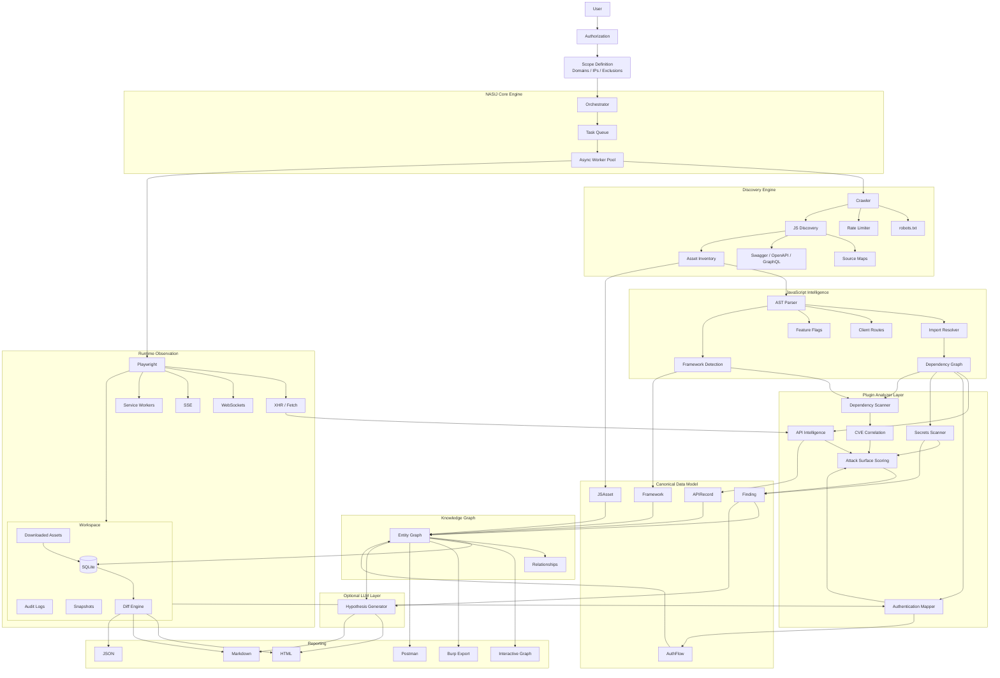

<div align="center">

```
[size=9px][font=monospace][color=#808080]<span style="color:#808080"> [/color]</span>
[color=#808080][/color][color=#808080] [/color]
[color=#808080][/color][color=#808080] [/color]
[color=#808080][/color][color=#808080] [/color]
[color=#808080][/color][color=#808080] [/color]
[color=#808080][/color][color=#808080] [/color]
[color=#808080][/color][color=#808080] [/color]
[color=#808080][/color][color=#808080] [/color]
[color=#808080][/color][color=#808080] [/color]
[color=#808080][/color][color=#808080] [/color]
[color=#808080][/color][color=#808080] [/color]
[color=#808080][/color][color=#808080]                                                 [/color][color=#5c5c5c]▄[/color][color=#474747]▄[/color][color=#363636]▓[/color][color=#686868]⌐[/color]
[color=#808080][/color][color=#808080]                                              [/color][color=#585858]▐[/color][color=#3a3a3a]▀[/color][color=#404040]▄[/color][color=#3f3f3f]▄[/color][color=#404040]▀[/color][color=#222222]█[/color][color=#464646]▄[/color]
[color=#808080][/color][color=#808080]                                              [/color][color=#525252]╙[/color][color=#050505]█[/color][color=#040404]█    [/color][color=#0c0c0c]█[/color][color=#3e3e3e]▌[/color]
[color=#808080][/color][color=#808080]                                     [/color][color=#737373]¬[/color][color=#6b6b6b],[/color][color=#636363]╓[/color][color=#585858]▄[/color][color=#4f4f4f]▄[/color][color=#464646]▄[/color][color=#494949]æ[/color][color=#4a4a4a]R[/color][color=#4d4d4d]▀[/color][color=#4e4e4e]▀[/color][color=#232323]█[/color][color=#010101]█[/color][color=#4a4a4a]▄[/color][color=#707070],[/color][color=#6f6f6f],[/color][color=#484848]▄[/color][color=#121212]█[/color][color=#2a2a2a]▀[/color][color=#232323]█[/color][color=#474747]▄[/color]
[color=#808080][/color][color=#808080]              [/color][color=#494949]▄[/color][color=#474747]▀[/color][color=#4c4c4c]▀[/color][color=#4d4d4d]▀[/color][color=#4c4c4c]▀[/color][color=#4b4b4b]▀[/color][color=#494949]φ[/color][color=#4a4a4a]▄[/color][color=#575757]▄[/color][color=#626262]L[/color][color=#696969],[/color][color=#6a6a6a],[/color][color=#676767],[/color][color=#636363]╓   [/color][color=#5b5b5b]▄[/color][color=#535353]▄[/color][color=#4b4b4b]▄[/color][color=#4a4a4a]æ[/color][color=#484848]φ[/color][color=#3f3f3f]▄  [/color][color=#313131]▓[/color][color=#4c4c4c]▀[/color][color=#4e4e4e]▀[/color][color=#4e4e4e]╙[/color][color=#525252]╙[/color][color=#101010]█[/color][color=#121212]█[/color][color=#6b6b6b]─   [/color][color=#010101]█    [/color][color=#303030]╫[/color][color=#000000]█[/color][color=#000000]█[/color][color=#131313]█[/color][color=#696969]─    [/color][color=#010101]█[/color][color=#0e0e0e]█[/color][color=#515151]▄[/color]
[color=#808080][/color][color=#808080]            [/color][color=#5f5f5f]╓[/color][color=#2e2e2e]▌           [/color][color=#6b6b6b]─ [/color][color=#1c1c1c]█[/color][color=#080808]█[/color][color=#494949]▄[/color][color=#646464]j[/color][color=#383838]▌    [/color][color=#020202]█[/color][color=#070707]█[/color][color=#494949]▄[/color][color=#0b0b0b]█    [/color][color=#080808]█[/color][color=#2b2b2b]▌   [/color][color=#656565]j[/color][color=#040404]█     [/color][color=#373737]▀[/color][color=#3c3c3c]▀[/color][color=#4d4d4d]╙     [/color][color=#010101]█[/color][color=#000000]█[/color][color=#000000]█[/color][color=#1e1e1e]█[/color]
[color=#808080][/color][color=#808080]            [/color][color=#1a1a1a]█   [/color][color=#6b6b6b],[/color][color=#4f4f4f]▄[/color][color=#555555]▄[/color][color=#707070].       [/color][color=#060606]█[/color][color=#000000]█[/color][color=#000000]█[/color][color=#090909]█[/color][color=#414141]▌    [/color][color=#424242]╙[/color][color=#191919]█[/color][color=#222222]▀[/color][color=#4a4a4a]▀    [/color][color=#5c5c5c]╙                  [/color][color=#1d1d1d]█[/color][color=#000000]█[/color][color=#010101]█[/color][color=#000000]█[/color][color=#010101]█[/color][color=#646464]⌐[/color]
[color=#808080][/color][color=#808080]            [/color][color=#343434]▀[/color][color=#060606]█[/color][color=#171717]█[/color][color=#3b3b3b]▌[/color][color=#424242]▀[/color][color=#666666]─        [/color][color=#555555]╙[/color][color=#4f4f4f]╙[/color][color=#565656]╙[/color][color=#616161]└[/color][color=#6c6c6c]─                      [/color][color=#5f5f5f]╔      [/color][color=#6f6f6f],[/color][color=#424242]▄[/color][color=#080808]█[/color][color=#000000]█[/color][color=#010101]█[/color][color=#010101]█[/color][color=#000000]█[/color][color=#020202]█[/color]
[color=#808080][/color][color=#808080]             [/color][color=#242424]█[/color][color=#5e5e5e]└    [/color][color=#747474],[/color][color=#484848]▄[/color][color=#262626]▓[/color][color=#0d0d0d]█           [/color][color=#6c6c6c],       [/color][color=#656565]ç   [/color][color=#707070],[/color][color=#2d2d2d]▓[/color][color=#434343]▄[/color][color=#626262]╓[/color][color=#656565]╓[/color][color=#555555]▄[/color][color=#2e2e2e]▓[/color][color=#010101]█[/color][color=#010101]█[/color][color=#171717]█[/color][color=#272727]▓[/color][color=#272727]▓[/color][color=#1b1b1b]█[/color][color=#070707]█[/color][color=#010101]█[/color][color=#000000]█[/color][color=#010101]█[/color][color=#010101]█[/color][color=#000000]█[/color][color=#010101]█[/color][color=#010101]█[/color][color=#4b4b4b]▀[/color]
[color=#808080][/color][color=#808080]            [/color][color=#1a1a1a]█     [/color][color=#333333]▓[/color][color=#494949]▀  [/color][color=#4a4a4a]╙[/color][color=#292929]▓[/color][color=#707070],       [/color][color=#636363]╓[/color][color=#343434]▓[/color][color=#010101]█[/color][color=#232323]█[/color][color=#434343]▄[/color][color=#494949]▄[/color][color=#434343]▄[/color][color=#393939]▓[/color][color=#232323]█[/color][color=#020202]█[/color][color=#010101]█[/color][color=#060606]█[/color][color=#101010]█[/color][color=#060606]█[/color][color=#000000]█[/color][color=#000000]█[/color][color=#000000]█[/color][color=#010101]█[/color][color=#000000]█[/color][color=#000000]██[/color][color=#010101]█[/color][color=#010101]█[/color][color=#010101]█[/color][color=#010101]█[/color][color=#000000]█[/color][color=#010101]█[/color][color=#010101]█[/color][color=#010101]█[/color][color=#010101]█[/color][color=#010101]█[/color][color=#000000]█[/color][color=#020202]█[/color][color=#282828]▀[/color][color=#676767]─[/color]
[color=#808080][/color][color=#808080]            [/color][color=#292929]▌     [/color][color=#050505]█[/color][color=#515151]▄  [/color][color=#4a4a4a]▄[/color][color=#000000]█[/color][color=#000000]█[/color][color=#070707]█[/color][color=#151515]█[/color][color=#141414]█[/color][color=#0e0e0e]█[/color][color=#050505]█[/color][color=#292929]▀[/color][color=#464646]▀[/color][color=#434343]▀[/color][color=#191919]█[/color][color=#393939]▀[/color][color=#626262]└[/color][color=#676767]└[/color][color=#474747]╙[/color][color=#030303]█[/color][color=#000000]█[/color][color=#000000]█[/color][color=#010101]█[/color][color=#000000]█[/color][color=#010101]█[/color][color=#0b0b0b]█[/color][color=#292929]▀[/color][color=#1c1c1c]█[/color][color=#000000]█[/color][color=#000000]█[/color][color=#000000]█[/color][color=#040404]█[/color][color=#181818]█[/color][color=#010101]█[/color][color=#010101]█[/color][color=#010101]█[/color][color=#151515]█[/color][color=#3e3e3e]▀[/color][color=#6d6d6d]~[/color][color=#494949]╙[/color][color=#363636]▀[/color][color=#333333]▀[/color][color=#363636]▀[/color][color=#444444]▀[/color][color=#5d5d5d]└[/color]
[color=#808080][/color][color=#808080]            [/color][color=#151515]█      [/color][color=#5a5a5a]╙[/color][color=#4e4e4e]╙[/color][color=#4f4f4f]╙[/color][color=#555555]╙[/color][color=#616161]└  [/color][color=#595959]╙[/color][color=#000000]█[/color][color=#000000]█[/color][color=#272727]▌        [/color][color=#141414]█[/color][color=#000000]█[/color][color=#010101]█[/color][color=#010101]█[/color][color=#393939]▌[/color][color=#3e3e3e]▄[/color][color=#282828]▓[/color][color=#0b0b0b]█[/color][color=#010101]█[/color][color=#000000]█[/color][color=#000000]█[/color][color=#262626]█[/color]
[color=#808080][/color][color=#808080]            [/color][color=#5b5b5b]╙[/color][color=#2e2e2e]▓             [/color][color=#111111]█[/color][color=#000000]█[/color][color=#010101]█[/color][color=#323232]▓[/color][color=#4f4f4f]▄[/color][color=#494949]▄[/color][color=#1c1c1c]█[/color][color=#080808]█[/color][color=#282828]▓[/color][color=#2a2a2a]▓[/color][color=#0b0b0b]█[/color][color=#010101]█[/color][color=#010101]█[/color][color=#010101]█[/color][color=#000000]█[/color][color=#030303]█[/color][color=#000000]█[/color][color=#000000]█[/color][color=#010101]█[/color][color=#010101]█[/color][color=#000000]█[/color][color=#000000]█[/color][color=#010101]█[/color][color=#575757]Γ[/color]
[color=#808080][/color][color=#808080]              [/color][color=#383838]▀[/color][color=#2e2e2e]▓[/color][color=#505050]▄[/color][color=#666666]µ    [/color][color=#6d6d6d],[/color][color=#606060]▄[/color][color=#4f4f4f]▄[/color][color=#393939]▓[/color][color=#1f1f1f]█[/color][color=#030303]█[/color][color=#000000]█[/color][color=#000000]█[/color][color=#010101]█[/color][color=#222222]█[/color][color=#060606]█[/color][color=#000000]█[/color][color=#000000]█[/color][color=#000000]█[/color][color=#000000]█[/color][color=#010101]█[/color][color=#010101]███[/color][color=#000000]█[/color][color=#282828]▌[/color][color=#606060]└[/color][color=#1a1a1a]█[/color][color=#0b0b0b]█[/color][color=#282828]▀[/color][color=#434343]▀[/color][color=#626262]┘[/color]
[color=#808080][/color][color=#808080]                [/color][color=#282828]▀[/color][color=#010101]█[/color][color=#010101]█[/color][color=#010101]█[/color][color=#010101]█[/color][color=#000000]█[/color][color=#010101]█[/color][color=#000000]█[/color][color=#000000]█[/color][color=#000000]█[/color][color=#010101]█[/color][color=#010101]█[/color][color=#010101]█[/color][color=#010101]█[/color][color=#000000]█[/color][color=#101010]█ [/color][color=#3e3e3e]▀[/color][color=#121212]█[/color][color=#050505]█[/color][color=#0f0f0f]█[/color][color=#343434]▀[/color][color=#373737]▀[/color][color=#272727]▀[/color][color=#303030]▀[/color][color=#4e4e4e]╙[/color]
[color=#808080][/color][color=#808080]                 [/color][color=#656565]┘[/color][color=#333333]▀[/color][color=#0f0f0f]█[/color][color=#010101]█[/color][color=#010101]█[/color][color=#000000]█[/color][color=#000000]█[/color][color=#000000]█[/color][color=#000000]█[/color][color=#010101]█[/color][color=#010101]█[/color][color=#121212]█[/color][color=#282828]▀[/color][color=#424242]▀[/color][color=#636363]┘[/color]
[color=#808080][/color][color=#808080]                     [/color][color=#6c6c6c]¬[/color][color=#656565]┘[/color][color=#616161]┴[/color][color=#636363]┘[/color][color=#6a6a6a]¬[/color]
[color=#808080][/color][color=#808080] [/color]
[color=#808080][/color][color=#808080] [/color]
[color=#808080][/color][color=#808080] [/color]
[color=#808080][/color][color=#808080] [/color]
[color=#808080][/color][color=#808080] [/color]
[color=#808080][/color][color=#808080] [/color]
[color=#808080][/color][color=#808080] [/color]
[color=#808080][/color][color=#808080] [/color]
[/font][/size]
```

</div>

---

## Overview

NASIJ is an intelligent reconnaissance framework designed for **authorized Bug Bounty programs, Penetration Tests, and Application Security assessments**.

Unlike traditional reconnaissance tools that generate flat lists of URLs or endpoints, NASIJ builds an **interactive knowledge graph** describing how a web application works.

It correlates JavaScript, APIs, authentication, runtime behavior, dependencies, and framework intelligence into a unified model that helps researchers quickly understand an application's attack surface.

---

## Vision

Modern web applications are complex.

Traditional recon produces thousands of URLs, endpoints, and JavaScript files, forcing researchers to manually connect everything together.

NASIJ automates that correlation.

```
Application
      │
      ▼
JavaScript
      │
      ▼
APIs
      │
      ▼
Authentication
      │
      ▼
Dependencies
      │
      ▼
Knowledge Graph
      │
      ▼
Prioritized Manual Testing
```

The objective is **not automated exploitation**.

The objective is to dramatically reduce the time required to understand modern applications.

---

# Features

## Discovery

- Scope-aware crawling
- JavaScript discovery
- Dynamic chunk collection
- Source Map discovery
- OpenAPI discovery
- Swagger discovery
- GraphQL discovery
- Asset fingerprinting
- Hash-based tracking

---

## JavaScript Intelligence

- AST parsing
- Import resolution
- Dependency graph generation
- Route extraction
- Framework detection
- Configuration extraction
- Feature flag discovery
- Dynamic URL resolution

---

## Runtime Intelligence

Powered by Playwright.

Collects:

- Fetch requests
- XHR
- WebSockets
- Server-Sent Events
- Service Workers
- localStorage
- sessionStorage
- IndexedDB

---

## API Intelligence

Automatically maps:

- REST APIs
- GraphQL
- WebSockets

Including:

- Methods
- Parameters
- Authentication
- Source files
- Calling functions
- Runtime evidence

---

## Authentication Mapping

Detects:

- JWT
- OAuth
- Cookie sessions
- Refresh tokens
- Storage locations
- Login flows

Automatically generates authentication diagrams.

---

## Security Intelligence

Detects:

- Exposed secrets
- API keys
- Cloud credentials
- Internal hostnames
- Vulnerable dependencies
- Outdated frameworks
- Sensitive client-side data

---

## Knowledge Graph

The heart of NASIJ.

Every discovered object becomes part of a unified graph.

Example relationships:

```
Page

↓

Component

↓

JavaScript Module

↓

API

↓

Authentication

↓

Storage

↓

Finding
```

---

# Architecture



---

# Design Principles

- AST-first analysis
- Passive-first reconnaissance
- Plugin-based architecture
- Evidence-driven findings
- Knowledge graph correlation
- Resumable workspaces
- Differential reconnaissance
- Framework-aware analysis
- Reproducible results

---

# Roadmap

## Phase 1

- Project foundation
- CLI
- Workspace manager
- Scope manager
- HTTP engine

---

## Phase 2

- Smart crawler
- JavaScript collector
- AST parser
- Framework detection

---

## Phase 3

- Runtime observation
- API intelligence
- Authentication mapping
- Secrets detection

---

## Phase 4

- Dependency correlation
- Knowledge graph
- Interactive reports
- Differential reconnaissance

---

## Phase 5

- Plugin SDK
- Public API
- Optional AI hypothesis engine

---

# Legal & Ethics

NASIJ is designed **only** for systems you are explicitly authorized to assess.

The framework enforces:

- Scope restrictions
- Request rate limiting
- Audit logging
- Passive reconnaissance by default

NASIJ does **not** automate exploitation or vulnerability attacks.

---

# License

MIT License