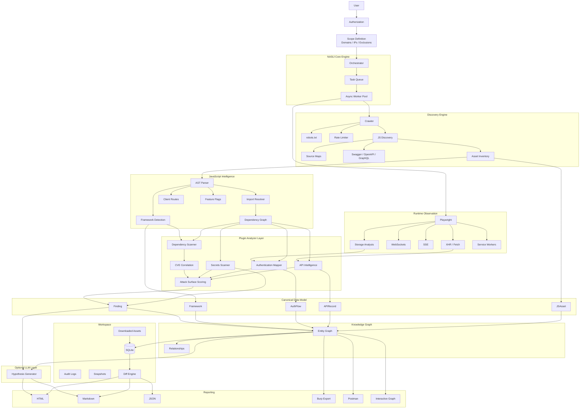

<div align="center">


### Intelligent JavaScript Reconnaissance Framework

*A scope-gated, passive-first recon engine that turns a target's client-side surface into a queryable knowledge graph — not another flat list of URLs.*

[](go.mod)
[](#license)
[](#roadmap)

</div>

---

## Overview

NASIJ is a reconnaissance framework built for **authorized bug bounty engagements, penetration tests, and application security assessments**.

Most recon tooling stops at producing a flat list of URLs, JS files, or endpoints, leaving the researcher to manually stitch everything back together. NASIJ instead builds an **interactive knowledge graph** describing how a target application actually works: which pages load which JavaScript modules, which modules call which APIs, how those APIs authenticate, and where secrets or vulnerable dependencies show up along the way.

```
Application → JavaScript → APIs → Authentication → Dependencies → Knowledge Graph → Prioritized Manual Testing
```

The goal is **not** automated exploitation. The goal is to cut the time it takes to understand a modern, JS-heavy application down to the point where a human can start testing hypotheses immediately.

---

## Features

**Discovery**
Scope-aware crawling · JavaScript discovery · dynamic chunk collection · source map discovery · OpenAPI / Swagger / GraphQL discovery · asset fingerprinting · hash-based tracking

**JavaScript Intelligence**
AST parsing · import resolution · dependency graph generation · route extraction · framework detection · config & feature-flag extraction · dynamic URL resolution

**Runtime Intelligence** *(via Playwright)*
Fetch/XHR · WebSockets · Server-Sent Events · Service Workers · localStorage / sessionStorage / IndexedDB

**API Intelligence**
Maps REST, GraphQL, and WebSocket surfaces, including methods, parameters, auth requirements, originating source files, calling functions, and runtime evidence.

**Authentication Mapping**
Detects JWT, OAuth, cookie sessions, refresh tokens, and storage locations, then auto-generates auth flow diagrams.

**Security Intelligence**
Exposed secrets, API keys, cloud credentials, internal hostnames, vulnerable/outdated dependencies, and sensitive client-side data.

**Knowledge Graph**
Every discovered object — page, component, module, API, auth flow, finding — becomes a node in a unified graph so relationships can be queried instead of guessed at.

---

## Installation

NASIJ is currently source-only (no tagged releases yet). You'll need **Go 1.26+**.

```bash
git clone https://github.com/two35s/NASIJ.git
cd NASIJ

# build a local binary into ./bin/nasij
make build

# or install straight into $GOPATH/bin
make install
```

Other useful targets: `make test`, `make test-cover`, `make lint`, `make fmt`, `make vet`, `make clean`, `make help`.

---

## Quick Start

```bash
# 1. Scaffold ~/.nasij with a default config.yaml
nasij init

# 2. Run a sanity check on your environment (Playwright, DB, config)
nasij doctor

# 3. Scan a target you are authorized to test
nasij scan --target https://target.example.com \
           --scope ./scope.yaml \
           --concurrency 10 \
           --rate-limit 2 \
           --depth 3 \
           --output ./workspace/target-example

# 4. Explore what was found
nasij graph   --workspace ./workspace/target-example
nasij rank    --workspace ./workspace/target-example
nasij report  list --workspace ./workspace/target-example
```

Only run `nasij scan` (or any active module) against targets covered by a scope you are explicitly authorized to test.

---

## CLI Reference

| Command | Purpose |
|---|---|
| `nasij init` | Scaffolds the `~/.nasij` directory tree and a default `config.yaml` |
| `nasij doctor` | Verifies runtime dependencies and configuration are working |
| `nasij scan` | Runs a full reconnaissance scan against a target |
| `nasij crawl` | Crawls a target to discover JS, endpoints, and app structure |
| `nasij auth` | Maps the authentication mechanisms of a target |
| `nasij secrets` | Scans a URL (via Playwright) or local file for exposed secrets/keys/tokens |
| `nasij deps` | Analyzes dependencies from package manifests and checks for CVEs |
| `nasij graph` | Builds and queries the knowledge graph |
| `nasij rank` | Scores and prioritizes findings across risk factors |
| `nasij workspace` | Manages scan workspaces |
| `nasij scope` | Manages scope definitions |
| `nasij config` | Views and edits NASIJ configuration |
| `nasij plugins` | Lists and inspects loaded plugins |
| `nasij report` | Lists, views, and exports scan reports |
| `nasij version` | Prints version, build, Go runtime, and platform info |

Run `nasij <command> --help` for the full flag list on any command. Key `scan` flags: `--target/-t`, `--scope/-s`, `--concurrency/-c`, `--rate-limit/-r`, `--depth/-d`, `--output/-o`.

Global flags: `--config <path>`, `--verbose/-v`, `--quiet/-q`.

---

## Configuration

NASIJ is configured via YAML (powered by Viper) and reads environment overrides as `NASIJ_<KEY>`:

```yaml
# ~/.nasij/config.yaml

# Logging
log_level: info      # debug | info | warn | error
log_format: pretty   # pretty | json

# Workspace
workspace_root: ~/.nasij/workspaces

# Database (per-workspace SQLite)
db:
  max_open_conns: 1
  max_idle_conns: 1

# Plugin system
plugin:
  dir: plugins        # directory scanned for .so plugin files
  enabled: true
```

See `configs/default.yaml` in the repo for the fully annotated reference copy.

---

## Architecture

<details>
<summary>Expand full architecture diagram</summary>



</details>

**Design principles:** AST-first analysis · passive-first reconnaissance · plugin-based architecture · evidence-driven findings · knowledge graph correlation · resumable workspaces · differential reconnaissance · framework-aware analysis · reproducible results.

---

## Tech Stack

| Layer | Library |
|---|---|
| CLI | [cobra](https://github.com/spf13/cobra) |
| Config | [viper](https://github.com/spf13/viper) |
| Interactive TUI | [bubbletea](https://github.com/charmbracelet/bubbletea) / [bubbles](https://github.com/charmbracelet/bubbles) / [lipgloss](https://github.com/charmbracelet/lipgloss) |
| Browser runtime | [playwright-go](https://github.com/mxschmitt/playwright-go) |
| Storage | [modernc.org/sqlite](https://gitlab.com/cznic/sqlite) (pure-Go, no CGO) |
| Logging | [zap](https://github.com/uber-go/zap) |
| Testing | [testify](https://github.com/stretchr/testify) |

---

## Roadmap

- [x] **Phase 1** — Project foundation, CLI, workspace manager, scope manager, HTTP engine
- [x] **Phase 2** — Smart crawler, JavaScript collector, AST parser, framework detection
- [ ] **Phase 3** — Runtime observation, API intelligence, authentication mapping, secrets detection
- [ ] **Phase 4** — Dependency correlation, knowledge graph, interactive reports, differential recon
- [ ] **Phase 5** — Plugin SDK, public API, optional AI hypothesis engine

*(Check-marks reflect the general direction of the project and may not exactly match current commit status — see [VISION.md](VISION.md) for the full narrative.)*

---

## Legal & Ethics

NASIJ is built **only** for systems you are explicitly authorized to assess. The framework enforces scope restrictions, request rate limiting, and audit logging, and defaults to passive reconnaissance. It does **not** automate exploitation or attacks against live vulnerabilities.

Using NASIJ against systems you do not have permission to test is illegal in most jurisdictions. You are responsible for your own authorization and scope.

---

## Contributing

Issues and PRs are welcome. Before submitting a change:

```bash
make fmt
make vet
make lint
make test
```

---

## License

[MIT](LICENSE)
